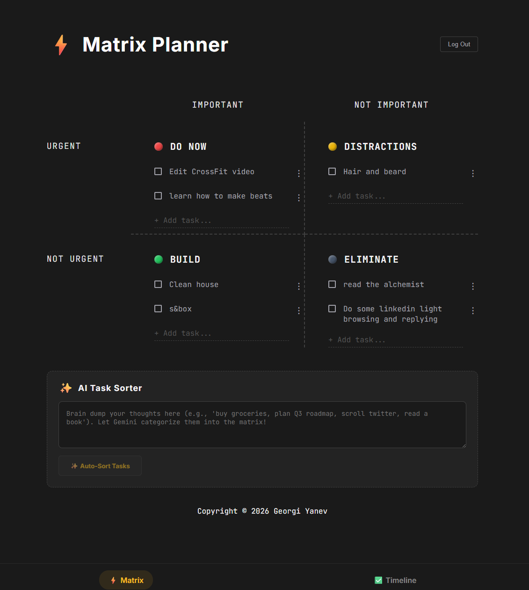

<h1 align="center">Matrix Planner ⚡</h1>

<p align="center">
  A minimalist, AI-powered Eisenhower Matrix planner for high-performance task management.
</p>

<p align="center">
  
</p>

## 🚀 Introduction

**Matrix Planner** is a high-speed productivity tool designed to help you master your daily workflow. Inspired by the **Eisenhower Matrix**, it automatically handles the "daily rollover" of tasks, keeps a historical timeline of your accomplishments, and uses **AI** to instantly categorize and break down complex items.

Keep your daily focus sharp by separating today's "Do Now" from the clutter of yesterday.

### 📘 Project details

⭐ **AI Task Sorter**: Streamline your brain dump into the four quadrants automatically using **Google Gemini**.
⭐ **AI Task Breakdown**: Complex task? Let the AI break it into 2-3 manageable sub-tasks for better momentum.
⭐ **Daily Rollover**: Unfinished tasks from previous days automatically roll over to a historical timeline view at midnight.
⭐ **Accomplishment Timeline**: A beautiful, scrollable history of your wins, complete with timestamps.
⭐ **Task Restoration**: Easily return any item (completed or missed) from the timeline back to your active matrix.
⭐ **Full Persistence**: Powered by **Supabase** for secure authentication and cloud storage.

## 🛠️ Tech Stack

- [React 19](https://reactjs.org/) & [TypeScript](https://www.typescriptlang.org/)
- [Supabase](https://supabase.com/) (Auth, Database)
- [Google Gemini 2.0 Flash](https://ai.google.dev/) (Task Intelligence)
- [Vite](https://vitejs.dev/) & [ESLint](https://eslint.org/)

## 💻 Running locally

To set up the project locally:

```bash
# 1. Clone the repository
$ git clone https://github.com/jumpalottahigh/matrix-planner.git

# 2. Install dependencies
$ cd matrix-planner
$ npm install

# 3. Environment Variables
# Copy the example file and update with your Supabase AND Gemini API keys:
$ cp .env.example .env

# 4. Fire it up
$ npm run dev
```

## 📄 License

This project is licensed under the [MIT License](LICENSE).

---

<p align="center">
  Built with ❤️ by <a href="https://georgi-yanev.com">Georgi Yanev</a>
</p>
